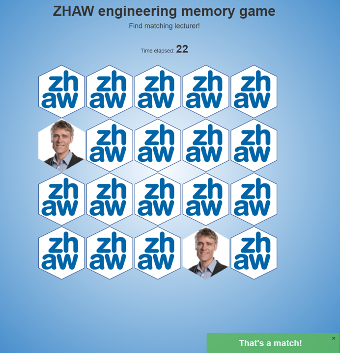

# ZHAW Engineering Memory Game

The repository is cloned and modified from: https://github.com/dreamRs/memory-hex

To run the application locally use:
```r
shiny::runGitHub(repo = "ObristD/zhaw-memory-game")
```


